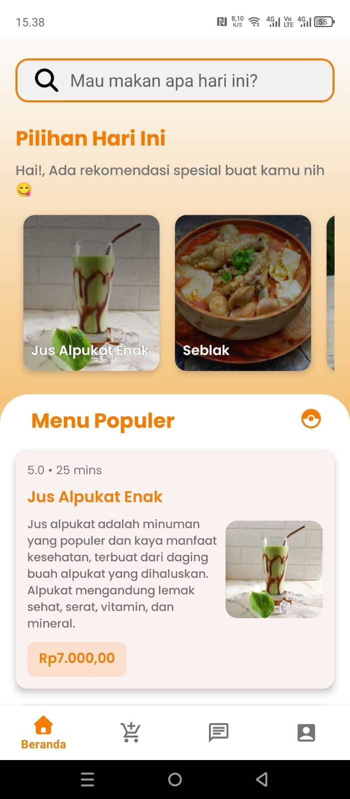
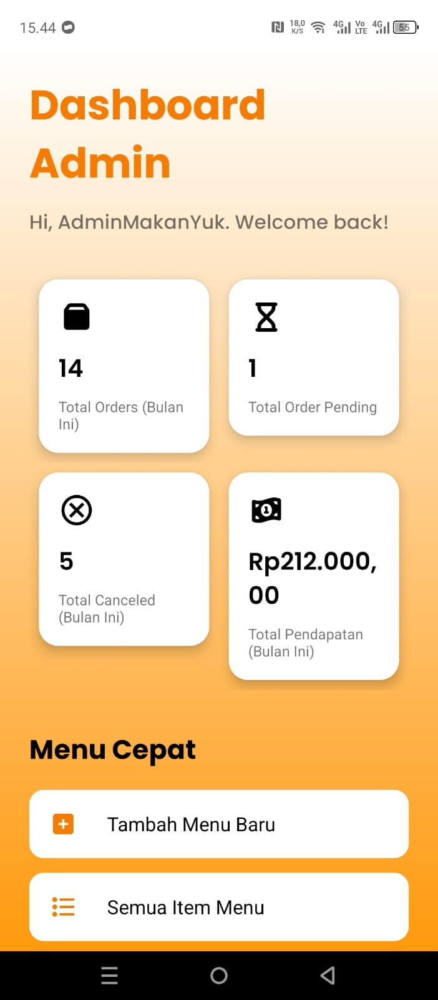

# Makan Yuk (Aplikasi Pemesanan Makanan Online)

## 1. Nama Project
**Makan Yuk** - Platform Delivery Makanan

## 2. Nama Kelompok & Anggota (Kelompok 3)
* Dzikri Arya Sahputra (701230035)
* Muhammad Rifqi Hidayat (701230009)
* Farhan Arya Dwitama (701230004)

## 3. Deskripsi Singkat Aplikasi
Makan Yuk adalah aplikasi mobile berbasis Android (Native) yang menghubungkan pengguna dengan berbagai makanan di Kota Jambi. Aplikasi ini memungkinkan pengguna untuk melihat menu, memesan makanan, melakukan pembayaran (COD/Digital), dan melacak status pesanan secara real-time. Proyek ini terdiri dari dua aplikasi: **Aplikasi Pelanggan** dan **Aplikasi Admin Restoran**.
### requirement Aplikasi
* Android OS 6.0+
* Snapdragon 425 or above
* 2GB ram
* 100 MB Space
### Pola Arsitektur
Arsitektur : N-Tier memisahkan sistem menjadi lapisan (tier) fisik atau logis yang berbeda
1. Tier Client (Presentation Layer)
* Aplikasi Pelanggan (Android): Digunakan oleh pelanggan untuk melihat menu dan memesan.
* Aplikasi Admin Restoran (Android): Digunakan oleh pemilik restoran untuk mengelola menu dan pesanan.
* Fungsi: Menangani antarmuka pengguna (UI) dan interaksi langsung dengan user.

2. Tier Server & Database (Data & Logic Layer)
* Firebase (Backend-as-a-Service): Bertindak sebagai server pusat.
* Firebase Authentication: Mengurus login dan registrasi.
* Cloud Firestore: Mengurus penyimpanan data (menu, pesanan).
* Fungsi: Menangani keamanan data, penyimpanan, dan sinkronisasi data antar aplikasi klien.

## 4. Tujuan Sistem / Permasalahan yang Diselesaikan
* **Permasalahan:** Kesulitan memesan makanan dari warung lokal tanpa harus datang ke lokasi, serta kebutuhan pemilik warung untuk mengelola pesanan digital.
* **Tujuan:** Mempermudah akses kuliner lokal secara digital, menyediakan sistem manajemen pesanan yang efisien bagi mitra, dan menyediakan pelacakan status pesanan yang transparan.

## 5. Teknologi yang Digunakan
* **Bahasa Pemrograman:** Java (Android Native)
* **IDE:** Android Studio Koala/Ladybug
* **Database:** Google Firebase Cloud Firestore (NoSQL)
* **Authentication:** Firebase Authentication (Email/Password)
* **Library Pendukung:**
    * `Glide` (Manajemen Gambar)
    * `CircleImageView` (UI Profil)
    * `Material Design Components` (UI Modern)

## 6. Cara Menjalankan Aplikasi

### a. Cara Instalasi (Developer Mode)
1.  Clone repository aplikasi user ini: `git clone [https://github.com/DzikriAryaSahputra/MakanYuk-User.git]`
2.  Buka project di **Android Studio**.
3. **PENTING:** Tambahkan file `google-services.json` ke dalam folder `app/`. (File ini tidak disertakan di repo demi keamanan).
4. Biarkan Gradle melakukan *sync*.

### b. Cara Menjalankan (Run Project)
1.  Hubungkan HP Android via USB (Debugging on) atau gunakan Emulator.
2.  Klik tombol **Run (Play)** di Android Studio.
3.  Pastikan koneksi internet aktif karena aplikasi menggunakan Firebase.

### c. Cara Instal
1. Download aplikasi melalui link yang sudah disiapkan
2. Klik instal.
3. Jika ada peringatan dari google untuk pindai aplikasi, klik "pindai".
4. Setelah selesai pindai klik instal.

## 7. Akun Demo

Untuk pengujian, dapat menggunakan akun berikut:

**Aplikasi User (Pelanggan):**
* **Username:** User Demo
* **Email:** demo@makanyuk.com
* **Password:** 12345678

**Aplikasi Admin (Pemilik Resto):**
* **Email:** admin@makanyuk.com
* **Password:** admin123

## 8. Link Deployment / APK
* **Link Download APK User:** [https://www.mediafire.com/file/36m2z4unyqp099i/MakanYuk_v1.0.apk/file]
* **Link Download APK Admin:** [https://www.mediafire.com/file/9bxyqul9njnafpt/AdminMakanYuk_v1.0.apk/file]

## 9. Screenshot Halaman Utama

## 10. Catatan Tambahan
* **Keterbatasan Sistem:**
    * Pembayaran Virtual Account masih berupa simulasi dan user harus input manual (belum terintegrasi Payment Gateway).
    * Peta lokasi masih menggunakan input teks manual, belum menggunakan Google Maps API (menghindari biaya billing).
    * Upload gambar masih menggunakan imageUrl (menghindari biaya billing).
* **Petunjuk Penting:**
    * Jika ingin mencoba atau clone aplikasi mohon untuk download file API KEY "google-service.json" melalui link berikut:
    * **Link Download API KEY:** [https://drive.google.com/file/d/1B8Wc-UARzAmjKazhs4Fpj8DmctfpBdEv/view?usp=drive_link]

## 11. Keterangan Tugas
Project ini ditujukan untuk memenuhi **Tugas Final Project Mata Kuliah Rekayasa Perangkat Lunak**.
**Dosen Pengampu:** Dila Nurlaila, M.Kom

---
Copyright © 2025 Kelompok 3 - Makan Yuk